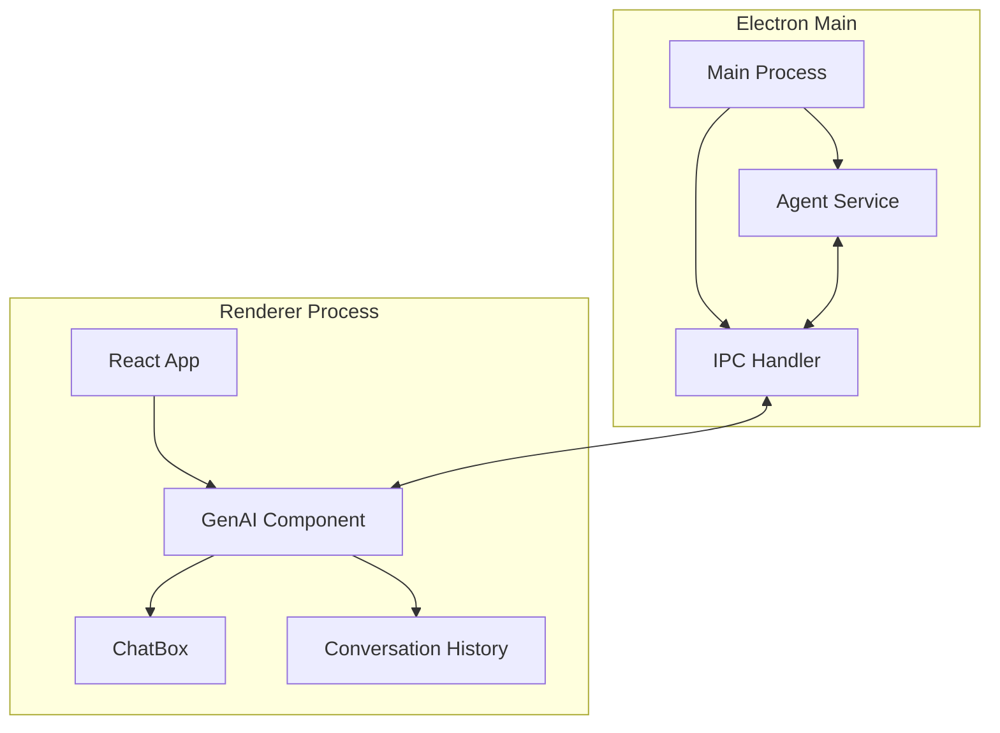

# GenAI Chat Agent Implementation Plan

## Overview
Implement a simple question-answering agent with memory using LangChain/LangGraph in an Electron+React+Vite application.

## Requirements
- Agent Type: Simple QA with memory
- UI: Raw text display (no CSS markup)
- IPC Channels: `genai:*` prefix

## Architecture


## Implementation Phases

### Phase 1: Backend (Electron Main Process)
1. **Create Agent Service** (`electron/main/agent.ts`)
   ```ts
   import { ConversationChain } from "langchain/chains";
   import { BufferMemory } from "langchain/memory";
   import { ChatOpenAI } from "langchain/chat_models/openai";
   
   class AgentService {
     private chain: ConversationChain;
     
     constructor() {
       const model = new ChatOpenAI({ temperature: 0 });
       this.chain = new ConversationChain({
         llm: model,
         memory: new BufferMemory(),
       });
     }
     
     async processMessage(input: string): Promise<string> {
       const response = await this.chain.call({ input });
       return response.response;
     }
   }
   
   export const agentService = new AgentService();
   ```

2. **Extend IPC Handlers** (`electron/main/index.ts`)
   ```ts
   import { agentService } from "./agent";
   
   ipcMain.handle("genai:send", async (_, message: string) => {
     return agentService.processMessage(message);
   });
   ```

3. **Add Dependencies** (`package.json`)
   ```json
   {
     "dependencies": {
       "@langchain/langgraph": "^0.1.0",
       "@langchain/core": "^0.1.0",
       "langchain": "^0.1.0"
     }
   }
   ```

### Phase 2: Frontend (React Components)
1. **Update GenAI Component** (`src/components/genai/genai.tsx`)
   ```tsx
   import { useState, useEffect } from "react";
   
   export default function GenAI() {
     const [conversation, setConversation] = useState<Array<{text: string, sender: string}>>([]);
     
     const handleSend = async (message: string) => {
       setConversation(prev => [...prev, {text: message, sender: 'user'}]);
       const response = await window.ipcRenderer.invoke('genai:send', message);
       setConversation(prev => [...prev, {text: response, sender: 'agent'}]);
     };
     
     return (
       <ResizablePanelGroup direction="vertical">
         <ResizablePanel>
           <div className="conversation-history">
             {conversation.map((msg, i) => (
               <div key={i}>
                 <strong>{msg.sender}:</strong> {msg.text}
               </div>
             ))}
           </div>
         </ResizablePanel>
         <ResizableHandle />
         <ResizablePanel defaultSize={30}>
           <ChatBox onSend={handleSend} />
         </ResizablePanel>
       </ResizablePanelGroup>
     );
   }
   ```

2. **Update ChatBox Component** (`src/components/genai/chatbox.tsx`)
   ```tsx
   export function ChatBox({ onSend }: { onSend: (message: string) => void }) {
     const [message, setMessage] = useState("");
     
     const handleSubmit = () => {
       if (message.trim()) {
         onSend(message);
         setMessage("");
       }
     };
     
     return (
       <div className="flex flex-col h-full gap-2">
         <Textarea
           value={message}
           onChange={(e) => setMessage(e.target.value)}
           placeholder="Type your message here."
           className="flex-1 resize-none"
         />
         <Button className="h-10" onClick={handleSubmit}>Send</Button>
       </div>
     );
   }
   ```

### Phase 3: Testing
1. **Unit Tests**:
   - Agent service message processing
   - IPC channel validation

2. **Integration Test**:
   - Full message roundtrip from UI to agent and back

3. **Manual Verification**:
   - Send test message through UI
   - Verify response appears in conversation history