

# Autai

**The AI assistant that actually does things.**

Tell it what you need and it drives a real browser for you — booking flights, filling forms, comparing prices. Ask a question and it reads the web so you don't have to. Hand it a bloated novel and it edits the filler out before you read a word. Your API keys, your models, running on your machine.

[Download](https://github.com/upwindchange/autai/releases) · [Features](#features) · [Entertainment Mode](#-entertainment-mode) · [Getting Started](#getting-started) · [简体中文](docs/README.zh-CN.md)

---

## Watch it work

**"Add these five things to my Target cart."** One sentence. Autai opens the browser, searches for each item, and drops it in the cart while you watch.

<video src="https://github.com/user-attachments/assets/f8b8d85e-3679-4deb-a5de-8fe64092d161" controls="controls" style="max-width:100%;"></video>

**"What are the best laptops under $1,000 in 2026?"** Research mode fans out across the web, reads the sources, and comes back with a synthesized answer — citations included.

<video src="https://github.com/user-attachments/assets/7ac38b43-3e9c-4034-a7cf-8b8ef081bb13" controls="controls" style="max-width:100%;"></video>

Videos sped up to fit GitHub's 10&nbsp;MB limit — real speed depends on your model.

---

## Three ways to put it to work

<table>
  <tr>
    <td width="33%" valign="top">
      <h3 align="center">🖥️ Browser Automation</h3>
      
The AI plans the steps, then operates a real browser to finish the job — forms, bookings, carts, cross-store comparisons. It pauses and hands control back to you the moment a CAPTCHA, login, or payment shows up.

    </td>
    <td width="33%" valign="top">
      <h3 align="center">🔎 Research</h3>
      
Quick, standard, or deep — Autai searches, opens the promising results, and reads them so you don't have to. Deep research splits your question into subtopics and returns a cited synthesis.

    </td>
    <td width="33%" valign="top">
      <h3 align="center">📖 Entertainment Mode</h3>
      
An AI copyeditor for the fiction you read. Feed it a web serial or a text file and it strips the padding, fixes the prose, translates, and serves the book in a proper reader. <a href="#-entertainment-mode">More below ↓</a>

    </td>
  </tr>
</table>

---

## Features

### Any provider, any model

OpenAI, Anthropic, Google, DeepSeek, Mistral, xAI, and 100+ more — or run models locally with Ollama. Bring your own API key, pick from 4,000+ models, switch whenever you like. See the [full catalog](https://models.dev/).

<table>
  <tr>
    <td width="50%" valign="top">
      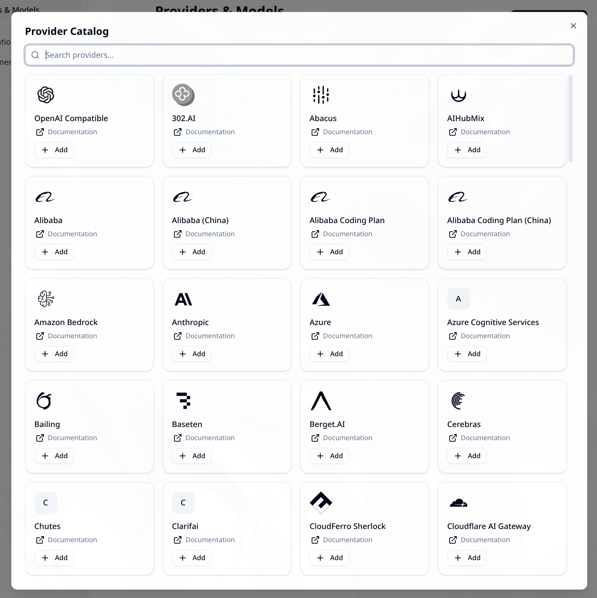
       <b>Bring your own provider</b> — paste a key and it works.
    </td>
    <td width="50%" valign="top">
      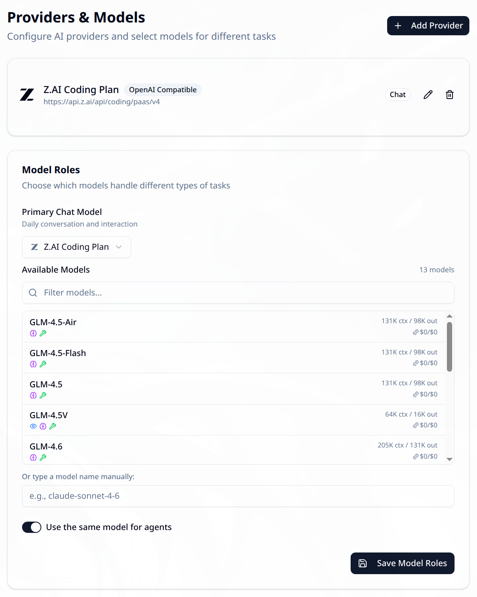
       <b>4,000+ models</b> — searchable, filterable, one click to switch.
    </td>
  </tr>
</table>

### Browser automation with you in the loop

- **Two driving styles** — *Simple* acts directly on your request; *Planned* drafts a step-by-step plan for your approval first.
- **Split view** — chat on one side, browser on the other. Every click, scroll, and form field happens in plain sight.
- **You stay in control** — CAPTCHAs, logins, and payment forms pause the agent and hand the wheel back to you.
- **Multi-session** — run several independent browser sessions side by side. Research one topic while Autai books your hotel in another window.

### Research that reads so you don't have to

Three efforts, one command bar: a quick pass when you just need a fact, standard search when you want a solid answer, and deep research that decomposes the question, chases every subtopic across sources, and writes it up with references.

### Conversations that organize themselves

Threads get auto-titled and tagged with color-coded labels. Flip to a tag-grouped view to see everything by category, search through your conversation history, and bulk-archive the old stuff. The sidebar stays tidy with zero effort on your part.

<table>
  <tr>
    <td width="50%" valign="top">
      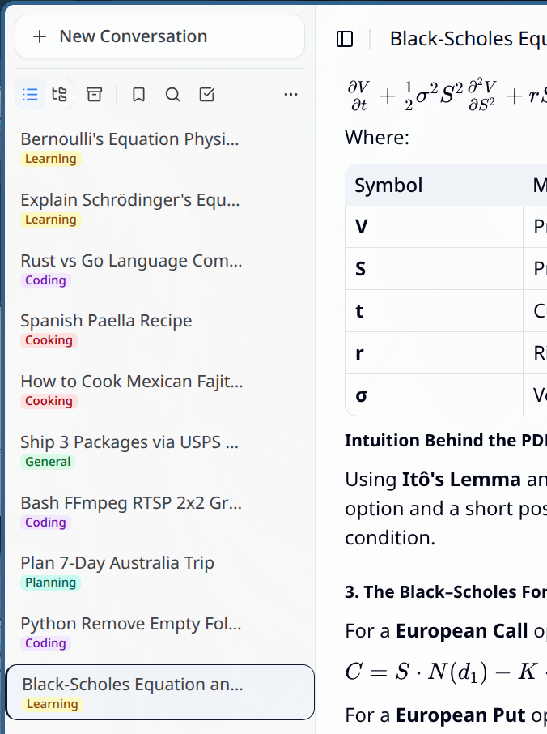
       <b>Auto-titled threads</b> — every conversation names itself.
    </td>
    <td width="50%" valign="top">
      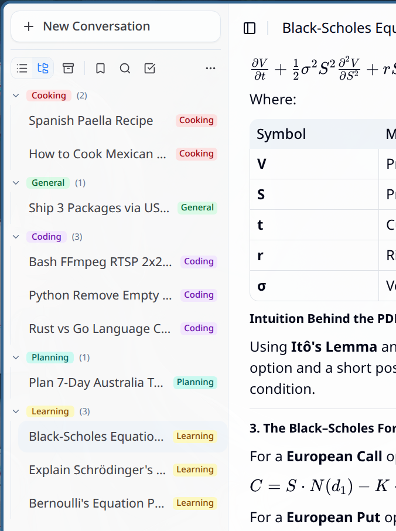
       <b>Tag-grouped view</b> — everything filed by topic.
    </td>
  </tr>
  <tr>
    <td width="50%" valign="top">
      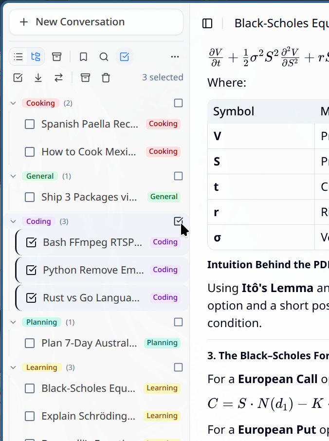
       <b>Color-coded tags</b> for quick scanning.
    </td>
    <td width="50%" valign="top">
      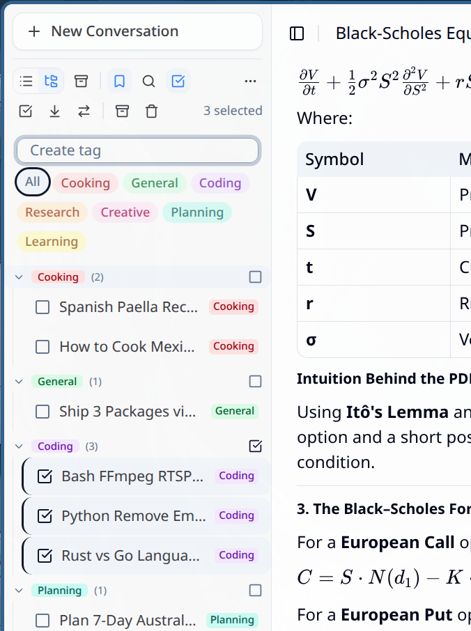
       <b>Tag management</b> — rename, recolor, merge.
    </td>
  </tr>
  <tr>
    <td width="50%" valign="top">
      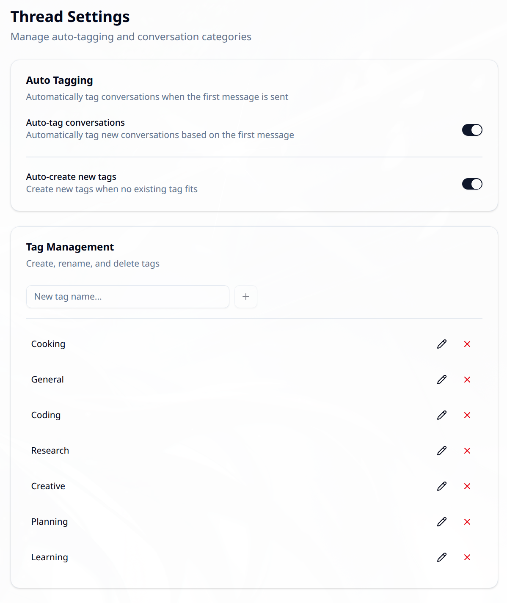
       <b>Per-thread labels</b>, editable anytime.
    </td>
    <td width="50%" valign="top">
      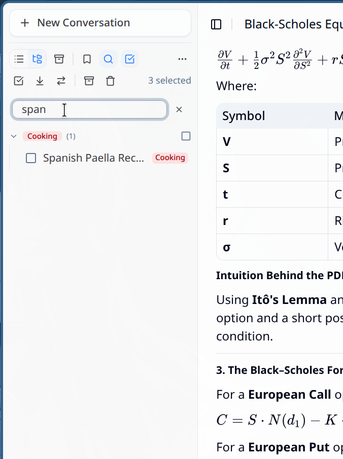
       <b>Search</b> — dig up any past conversation.
    </td>
  </tr>
</table>

### Answers worth reading

Code with syntax highlighting, math typeset like a textbook, Mermaid diagrams rendered as charts, full rich text. Complex answers come back looking like they were cared about.

<table>
  <tr>
    <td width="50%" valign="top">
      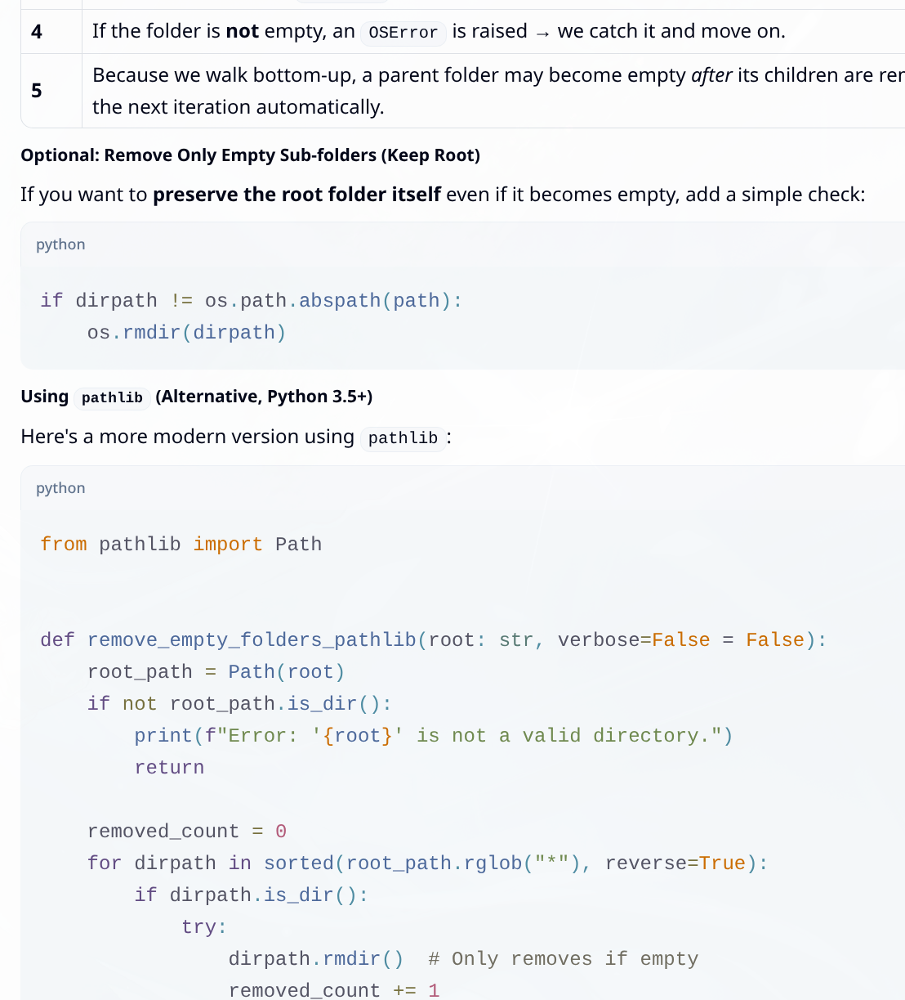
       <b>Code</b> — syntax-highlighted, copy-ready.
    </td>
    <td width="50%" valign="top">
      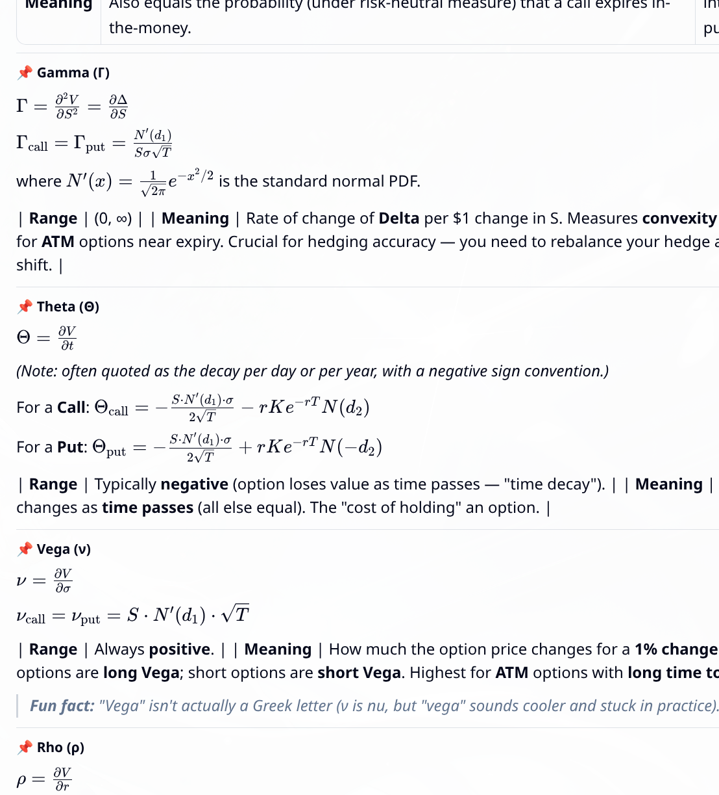
       <b>Math</b> — properly typeset equations.
    </td>
  </tr>
  <tr>
    <td width="50%" valign="top">
      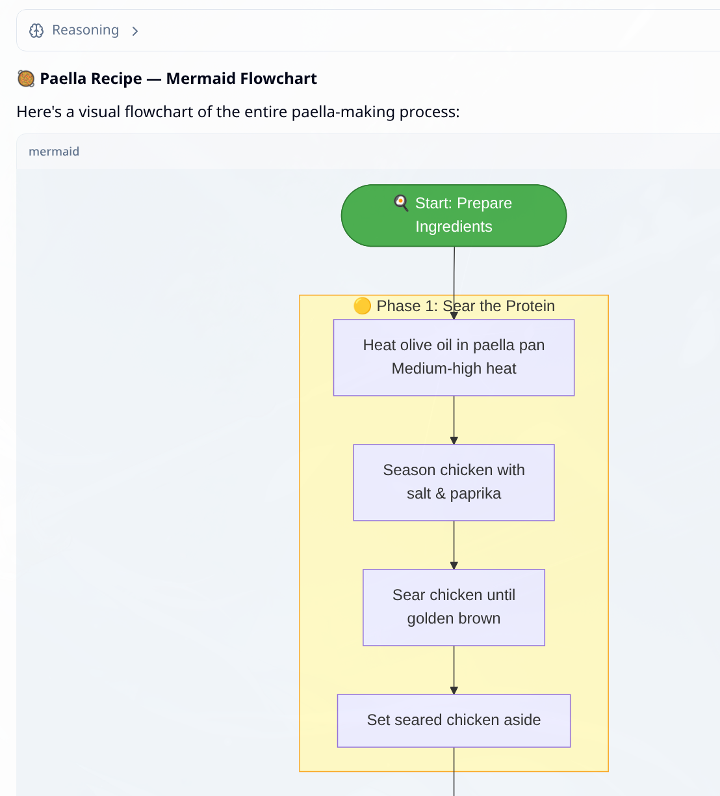
       <b>Diagrams</b> — Mermaid rendered as charts.
    </td>
  </tr>
</table>

### Bring your files into the conversation

Screenshots, documents, whatever you have — drop them in and the AI works with them.

<table>
  <tr>
    <td width="50%" valign="top">
      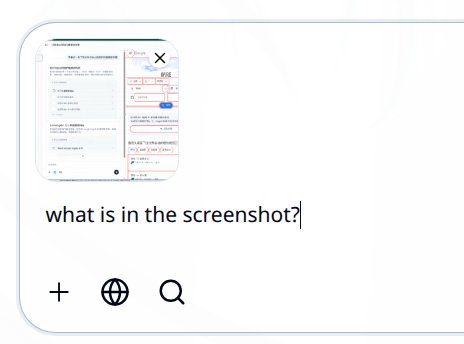
       <b>Attach an image</b> — screenshots included.
    </td>
    <td width="50%" valign="top">
      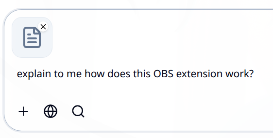
       <b>Attach a file</b> — any format the model reads.
    </td>
  </tr>
  <tr>
    <td width="50%" valign="top">
      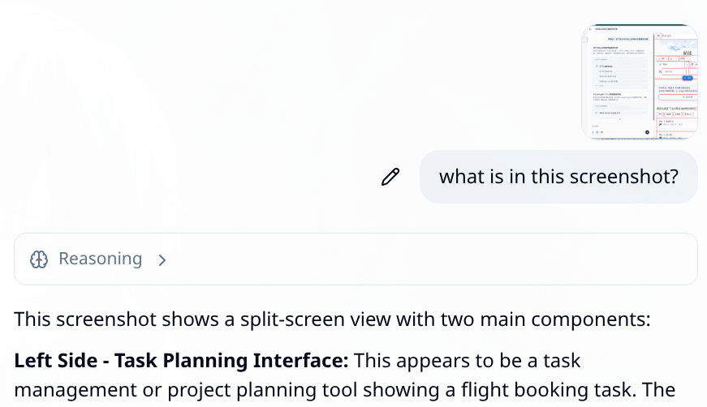
       <b>In context</b> — discussed, not just stored.
    </td>
  </tr>
</table>

### Power-user corner

<b>Everything else worth knowing</b>

- **Per-conversation overrides** — model, temperature, max tokens, and system prompt, set per thread.
- **Slash commands** — switch between browser, quick search, and deep research without leaving the keyboard.
- **MCP servers** — plug external tool servers into Autai from Settings.
- **Remote access** — expose Autai on your network with password auth, then use it from any browser — phone included.
- **Spoken answers** — built-in speech synthesis reads replies aloud.
- **Dark, light, or system theme** — your call.
- **English and 中文 UI** — switch languages in-app.

---

## 📖 Entertainment Mode

Not everything you want to read was edited by someone who cared. Web serials ship a chapter a day and it shows. Fan translations fight grammar to a draw. Some books are 40% story and 60% word count. Entertainment Mode puts an AI editor between you and the rough draft.

Point Autai at any readable web page, or drop in a text file, and it rebuilds the book before you read it:

- **Cut the word count, keep the story.** Last chapter recapped again, the magic system re-explained, another tournament round, one more collective gasp from the crowd — compressed on contact. A single dial sets how hard, from *light touch* to *get on with it*. The plot, characters, payoffs, and foreshadowing stay exactly where the author left them.
- **Fix the prose.** Grammar, punctuation, and the clichés every serial leans on — rewritten until they stop being clichés. Or run it the other direction: an expansion pass turns flat fight scenes into set pieces, without padding a single paragraph.
- **Read fiction from any language.** Translate the whole book, untangle transliterated names until you can actually tell the cast apart, restore the *"…," she said* that Japanese light novels drop, or type one custom instruction — *"keep the poems in verse"* — and it complies.

The rewritten book lives in a proper reader — eleven themes, typography controls down to letter spacing, a table of contents, bookmarks, zen mode, and it remembers exactly where you stopped. Chapters export as files whenever you want them offline.

Audiobook mode — full multi-voice audio drama, or podcast-style narration — is in development.

---

## Getting Started

1. **[Download](https://github.com/upwindchange/autai/releases) and install** Autai — builds for macOS, Windows, and Linux.
2. **Add an API key** from any supported provider (or point it at your local Ollama).
3. **Say what you want** — plain language, no config files, no learning curve.

Bugs and ideas? [Open an issue](https://github.com/upwindchange/autai/issues).

---

## Roadmap
- **Audiobook mode** — multi-voice audio drama and podcast-style narration for Entertainment Mode.
- **Flathub & auto-updates**.
- **More languages** for the UI.

---

## License

[MIT](LICENSE) — free to use, modify, and share.

---

**If Autai saved you some tab-hopping, a ⭐ helps others find it.**

