

<h1> Autai</h1>

### 你的 AI 浏览器助手

告诉 Autai 你想做什么，AI 就会替你操控浏览器——订机票、填表格、比价、查资料，日常上网能做的事它都能帮你做。我们还在拓展到完整的电脑操控能力，敬请期待。

[下载](https://github.com/upwindchange/autai/releases) · [功能介绍](#功能介绍) · [使用方法](#使用方法)

---

觉得好用的话，加个星⭐吧，让更多人看到这个项目！

---

## 实际效果

### 浏览器自动化

比如说一句"帮我把这些商品加到购物车里"——Autai就会打开浏览器，搜索商品，一个个加进购物车。

<video src="https://github.com/user-attachments/assets/f8b8d85e-3679-4deb-a5de-8fe64092d161" controls="controls" style="max-width:100%;"></video>

视频因GitHub 10MB大小限制做了加速，实际速度取决于你用的 LLM。

### 深度研究

切换到研究模式，问一句"2026 年有哪些千元以下值得买的笔记本？"——Autai 会自动搜索网页、阅读多个来源，帮你整理出清晰的答案。

<video src="https://github.com/user-attachments/assets/7ac38b43-3e9c-4034-a7cf-8b8ef081bb13" controls="controls" style="max-width:100%;"></video>

---

## 功能介绍

### 100+ AI 服务商，4000+ 模型

OpenAI、Anthropic、Google、DeepSeek、Mistral、xAI，国际/国内主流 AI 服务商全部支持。想用哪家用哪家，也可以用 Ollama 跑本地模型。填上你的 API Key，选个模型，直接开干。[完整列表：models.dev](https://models.dev/)。

  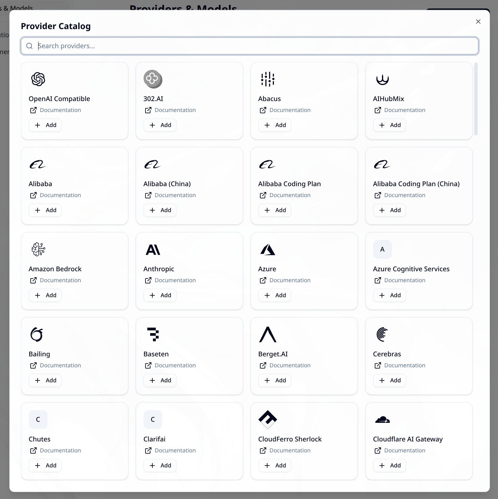
  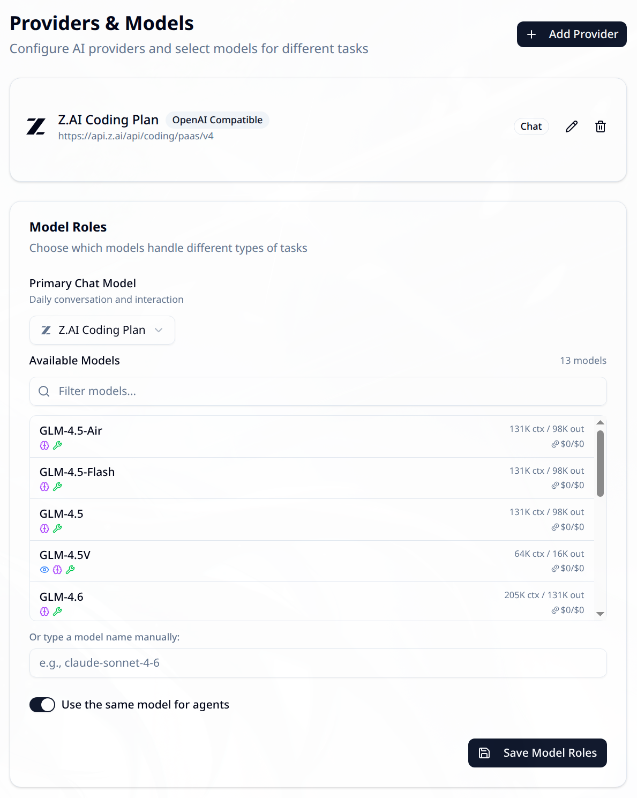

### 两种模式，各有擅长

**浏览器自动化**——AI 规划好任务步骤，然后操控真实浏览器来完成。订机票、填申请表、加购物车、跨平台比价，你在浏览器里能做的事，Autai 都可以试试。

**深度研究**——需要查资料的时候，Autai 会自动搜索网页、逐页阅读，然后给你整理出一份清晰的总结报告。不用再自己开二十个标签页一个个翻了。

### 智能对话管理

对话会自动打上彩色标签，方便你以后翻找。可以在列表视图和标签分组视图之间切换，按关键词搜索、按标签筛选，还可以批量归档旧对话。对话也会自动命名，侧边栏永远整整齐齐。

  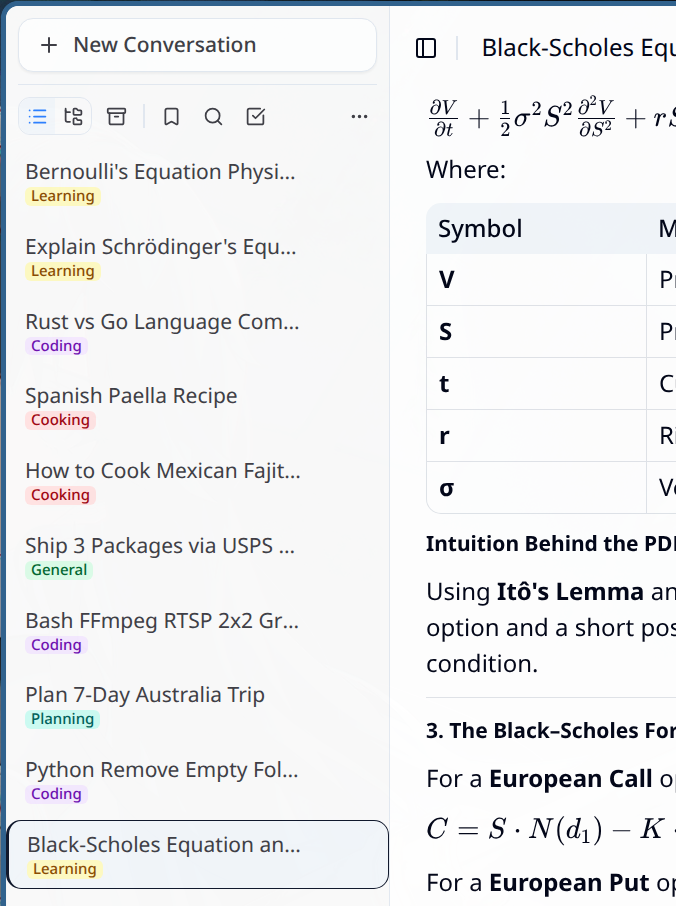
  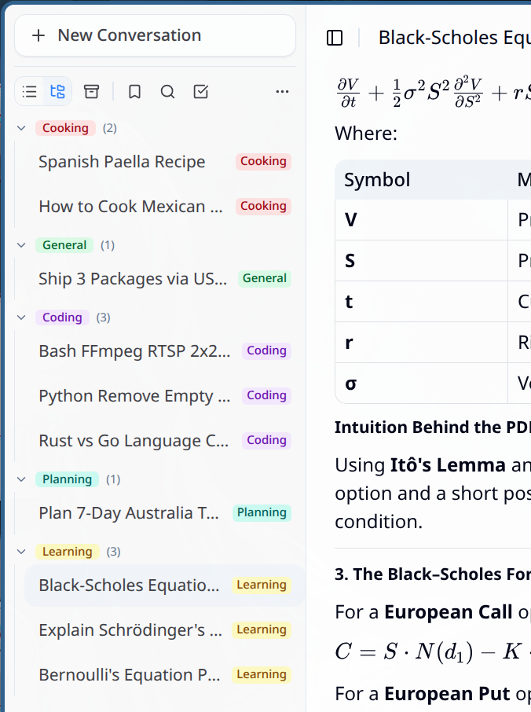

  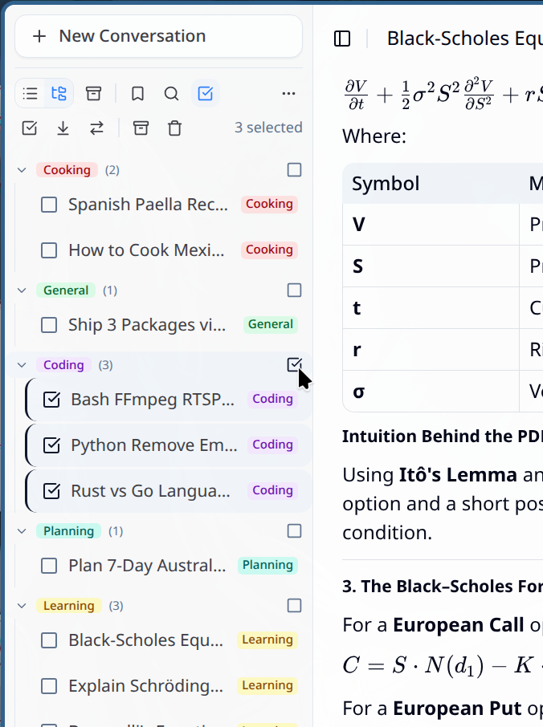
  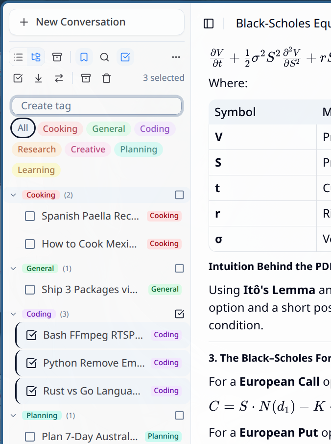
  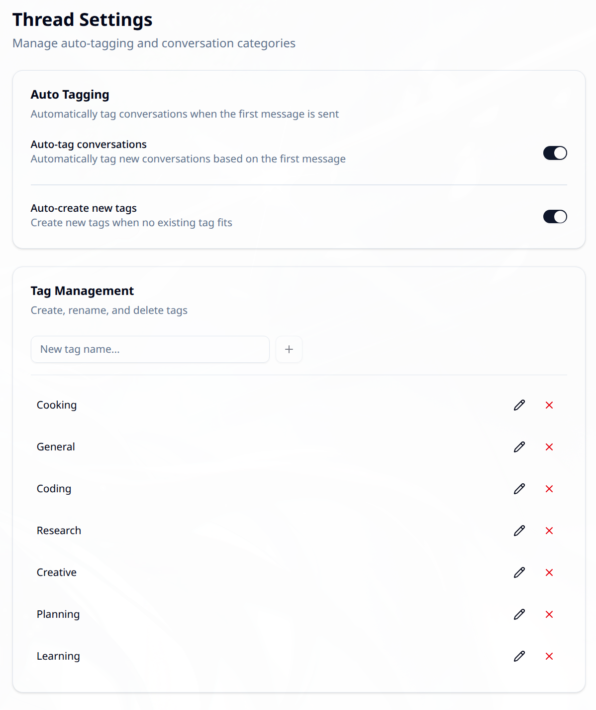

  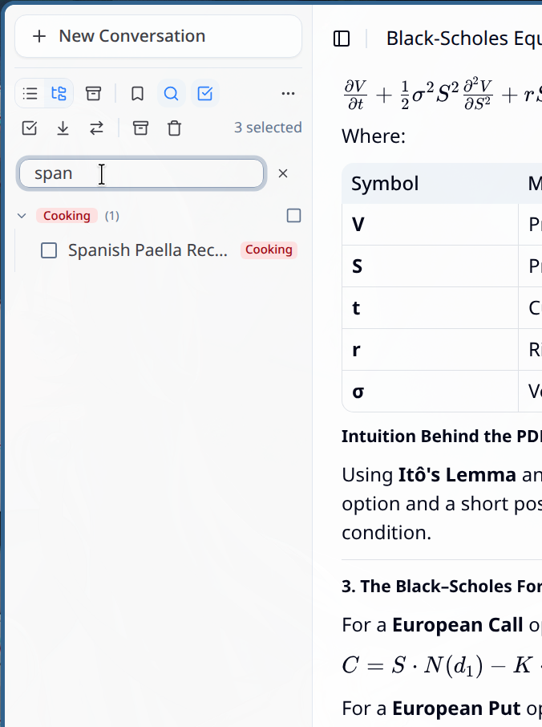

### 漂亮的 AI 回复

AI 的回复不是干巴巴的纯文本。代码有语法高亮，数学公式排版精美，Mermaid 图表直接渲染成可视化，富文本格式一应俱全——复杂的回答也能看得赏心悦目。

  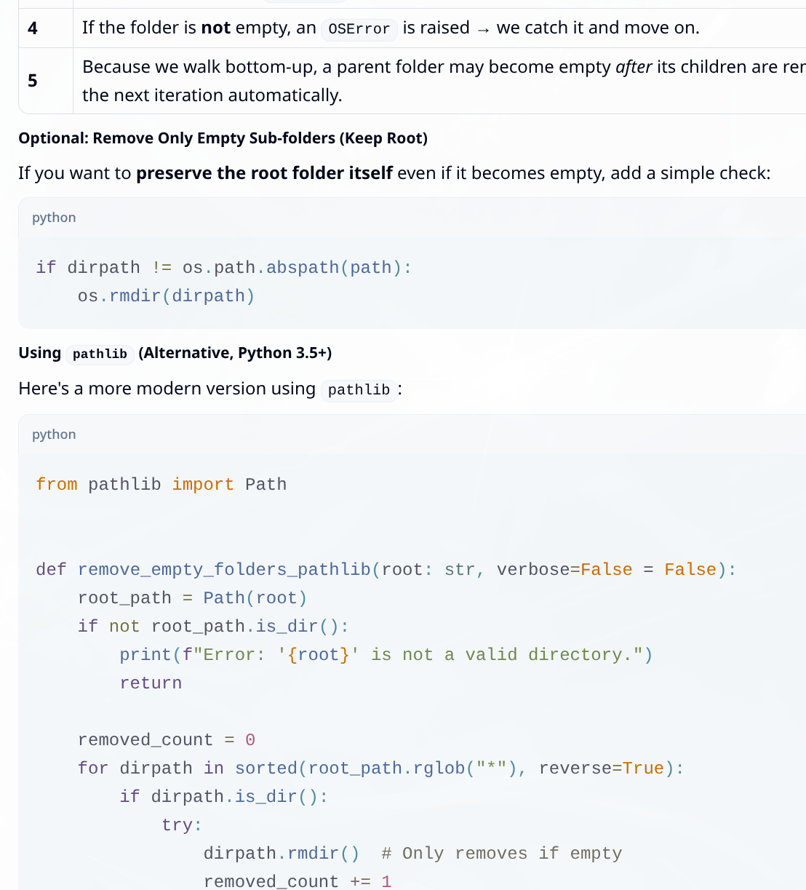
  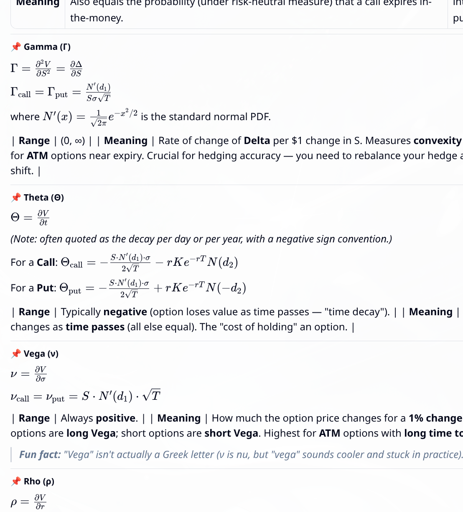
  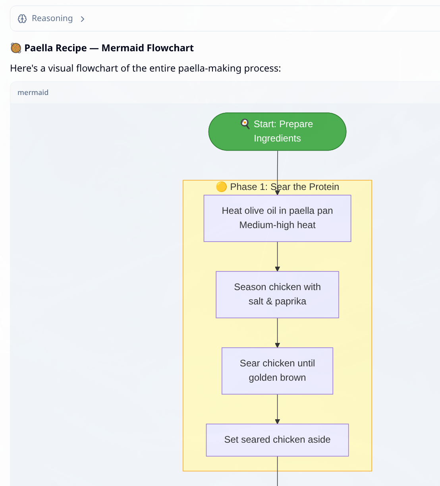

### 图片和文件附件

上传截图、文档或任意文件，AI 会把它融入到对话中。

  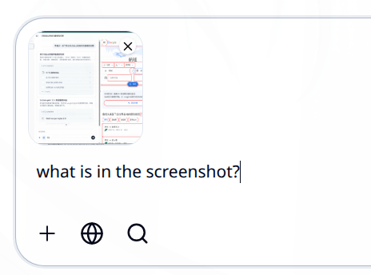
  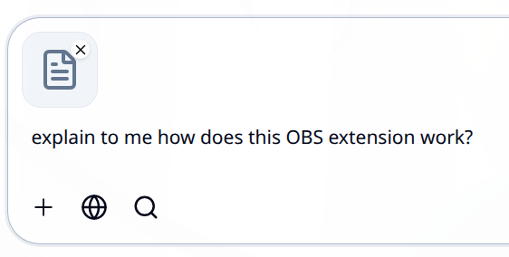
  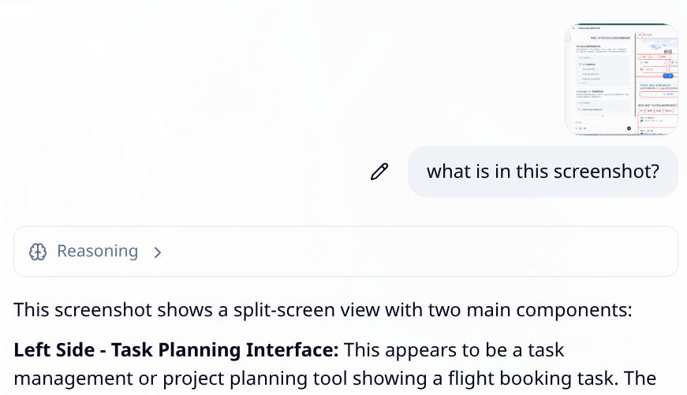

### 更多亮点

- **多会话浏览**——同时跑多个独立的浏览器会话。一边查资料，一边让 AI 在另一个窗口帮你订酒店，互不干扰。
- **全程可控**——遇到验证码、登录页面、支付表单这些不该自动处理的场景，AI 会暂停交给你操作。分屏模式下聊天和浏览器各占一边，每一步点击、滚动、填写都看得清清楚楚，没有黑箱。
- **语音朗读**——AI 可以把回答读出来，内置语音合成。
- **深色 / 浅色 / 跟随系统**——怎么舒服怎么来。
- **中英双语界面**——两种语言随心切换，更多语言持续增加中。

---

## 使用方法

1. **下载安装** Autai。
2. **填入 API Key**——从国际/国内服务商获取 API Key，粘贴到设置里。
3. **告诉它你要做什么**——用大白话说就行，就像跟朋友聊天一样。

就这样，上手即用。

---

## 路线图

- **alpha 1**——初始概念验证
- **alpha 2**——深度研究模式，研究 Agent 优化，输入焦点修复
- **alpha 3**——简易浏览器操控模式，浏览器 Agent 优化，工具修复
- **alpha 4**——标签颜色编辑，研究 Agent UI 优化，附件功能改进
- **alpha 5**——MCP 工具支持
- **alpha 6**——浏览器 Agent 自定义系统提示词和配置
- **alpha 7**——每个对话独立选择模型和工具
- **alpha 8**——对话全文搜索
- **alpha 9**——电脑操控概念验证（终端）
- **alpha 10**——CI/CD 流水线，macOS、Windows、Flathub 代码签名
- **beta 1**——开放 Issue 追踪，社区驱动 Bug 修复

---

## 项目状态

Autai 目前处于 **活跃的 Alpha 开发阶段**。功能可用且迭代迅速。进入 Beta 阶段后将开放 GitHub Issues 和 Pull Requests。

---

## 开源协议

[MIT](../LICENSE)——自由使用、修改和分享。

---

觉得好用的话，给个 Star ⭐ 吧，让更多人看到这个项目！

