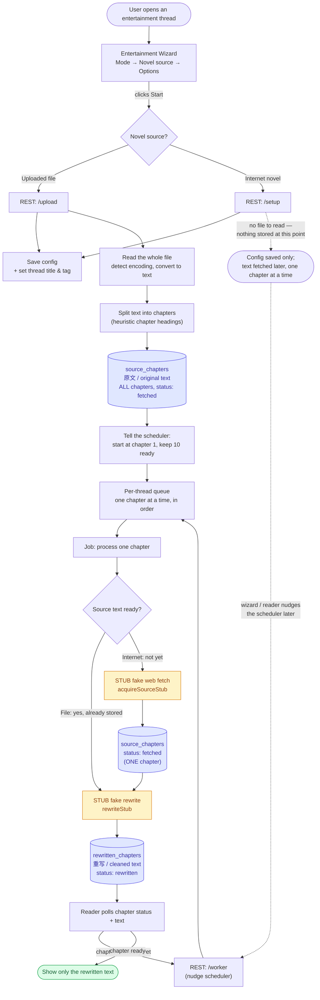

# Entertainment Mode — How It Actually Works

A plain-language map of the entertainment (novel-reading) mode: how a request
flows, what is real vs stub, and answers to the most common "how does X get to
Y?" questions.

---

## TL;DR

Entertainment mode has **one backend path**: the wizard talks to the backend
through small REST calls (`/upload` for a file, `/setup` for an internet novel).
The backend stores the config, splits a file into chapters (if any), and hands
the work straight to a **scheduler** that processes chapters one at a time.

Two things are **not finished yet**:

- **The rewrite is a stub.** The scheduler turns each chapter into "cleaned" text
  using fake filler, not a real AI rewrite. The AI model is not even wired into
  the scheduler yet — that is the next real piece of work.
- **`interactive` mode is a UI-only placeholder.** It shows up greyed-out
  ("coming soon") in the wizard and cannot be selected. There is no backend for
  it yet.

Everything below explains the live path in detail, then lists what is a stub.

---

## The big picture

**Legend**

- 🟡 yellow = **stub** (placeholder that returns fake text — the real logic is
  not built yet)
- 🟦 blue = **database table**
- 🟩 green = the final result the user actually sees

---

## The live flow, step by step

### 1. The wizard collects the request

When a user opens a fresh entertainment thread, they see a 3-step wizard:
choose a **mode** → choose a **novel source** → set **options**. On the last
step the button becomes **Start**.

> Note: the **interactive** mode is shown greyed-out behind a "coming soon" badge
> and cannot be selected — and it has no backend yet. Only **dehydrate** actually
> runs.

### 2. Start decides: file or internet

The wizard's Start action looks only at the **novel source type**, not the mode:

- **A file was picked** → it asks the backend to `/upload`.
- **An internet novel** (title + where to read it) → it asks the backend to
  `/setup`.

In both cases the backend first **saves the config** and stamps a deterministic
thread title and tag (e.g. `《Story》 — 重写`).

**This is where the two paths split for good.** The `/upload` route then goes on
to read, decode, and split the file. The `/setup` route **stops here** — for an
internet novel there is **no file** to read, so nothing is decoded, split, or
stored at this point. The text only appears later, fetched one chapter at a time
when the scheduler runs (see step 5).

### 3. The file gets decoded and split (file path only)

For an uploaded file the backend:

1. Reads the raw bytes (from the file path in desktop mode, or from base64 in a
   browser).
2. **Detects the text encoding** and converts it to a proper string — this is
   the part that makes GBK / GB2312 Chinese novels readable instead of garbled.
3. **Splits the whole file into chapters** at once using heuristic chapter
   headings (`第N章`, `#N#`, bare `N.` numbers, etc.).
4. Writes **every chapter** into the **`source_chapters`** table (the "original
   text" table), all marked as ready (`fetched`).

If no chapter headings are found, the entire file becomes one big chapter — it
never fails, it just produces a single chapter.

### 4. The scheduler keeps chapters ready ahead of the reader

After the file is stored, the wizard/route tells the **scheduler**: *"start at
chapter 1, and keep about 10 chapters ready ahead of wherever the reader is."*

Each thread gets its own **serial queue** (one chapter processed at a time, in
order). The scheduler is **idempotent**: the reader can keep nudging it
("please make sure chapter 5's window is ready") without duplicating work — it
just re-checks what's missing and fills the gaps.

### 5. Each chapter job does two things in a row

For each chapter, one job runs:

1. **Get the source text** —
   - For a **file**, it is already stored, so this step is skipped.
   - For an **internet** novel, it calls the **stub fetch** (see question 5) to
     "get" the chapter, then stores it.
2. **Rewrite** it — immediately, in the same job, the **stub rewrite** turns the
   source text into the "cleaned" version and stores it in the
   **`rewritten_chapters`** table.

So fetch and rewrite are **two halves of the same task**, not two separate
workers that message each other.

### 6. The reader polls and shows only the rewritten text

The reader never shows the original text. It **polls** the chapter status and,
once a chapter is `rewritten`, it displays the rewritten prose. If a chapter is
not ready yet, the reader nudges the scheduler and tries again.

---

## What is a stub or not yet built

- **The rewrite and the internet fetch are stubs.**
  Inside the scheduler, `rewriteStub` returns fake filler text and
  `acquireSourceStub` returns fake fetched text (internet novels only). The
  plumbing around them — the per-thread queue, the lookahead window, the
  acquire-then-rewrite job — is real; only the two text-producing steps are
  placeholders.

- **No AI model reaches the scheduler yet.**
  The scheduler receives no language model, so there is currently no place for a
  real rewrite to plug in. Wiring a model into the per-chapter job (and reading
  the saved rewriting options) is the next real piece of work.

- **The options sliders are collected but not consumed.**
  The wizard gathers rewriting options (basic toggles, depth sliders, custom
  instructions) and saves them to the config, but the scheduler does not read
  them yet — they will matter once the real rewrite lands.

- **`interactive` mode is a UI placeholder with no backend.**
  It appears in the wizard greyed-out ("coming soon") and is unselectable. The
  interactive config type and frequency option still exist in the shared schema
  and wizard, but there is no worker or route serving interactive mode today.

---

## Your six questions, answered again (plain language)

### 1. How is work sent into the worker?

When the user clicks **Start**, the wizard makes REST calls straight to the
backend's chapter endpoints — `/upload` for a file, `/setup` for an internet
novel. Those endpoints save the config and hand control directly to the
scheduler. There is no chat-style streaming worker involved; entertainment mode
is purely REST-driven.

### 2. How did the worker forward the work into the dehydrate worker?

**It doesn't — there is no such hop.** The old streaming router
(`EntertainmentWorker`) was removed entirely. The chapter REST route imports the
scheduler and calls it directly; there is nothing in between.

### 3. How did the dehydrate worker decide file vs internet?

By looking at the **saved config's novel type** (`file` or `internet`). Based on
that:

- **File** → every chapter was already stored up front during upload, so the
  scheduler skips "fetch" and goes straight to rewriting.
- **Internet** → no text is stored at upload time; the scheduler fetches each
  chapter on demand as the reader reaches it.

### 4. Is the file parser in a working state? If I really upload a file, will it
parse the whole file into chapters and load them into the original-text table?

**Yes — this part genuinely works, it is not a stub.** When you upload a file
the backend reads the entire file, detects and converts its encoding, splits it
into chapters, and stores **all** chapters into the `source_chapters`
(original-text) table, each marked as ready.

A few things to keep in mind:

- Chapter numbers are the **order they appear** in the file, not necessarily the
  number written in the heading (a `第3章` reference in the middle of chapter 50
  won't start a new chapter).
- If no headings are found, the whole file becomes **one** chapter.
- Uploading a second file to the same thread is a **silent no-op** (it won't
  overwrite).
- The **rewrite** that follows parsing is still a stub — so parsing works, but
  the "cleaned" text you see is placeholder filler for now.

### 5. Where is the stub internet fetch worker?

It is **not a separate file or worker** — it is a single small function
(`acquireSourceStub`) living inside the scheduler. It waits about 2.5 seconds and
returns fake chapter text. It only runs for **internet** novels; file novels
never call it.

### 6. How did the internet-fetch / text-parser worker trigger the rewrite worker
(even though it is a stub)?

It does not "trigger" a separate worker. **Fetch and rewrite are two halves of
the same per-chapter job.** Inside one chapter's job: first the source text is
made ready (skipped for files, faked for internet), and then the rewrite runs
immediately as the next step in the same job. They run back-to-back in order,
one chapter at a time per thread.

---

## Code map (for when you want to dig in)

| Concern | Where it lives |
| --- | --- |
| Wizard UI | `src/renderer/components/entertainment/wizard/` |
| Reader UI + polling store | `src/renderer/components/entertainment/reader/`, `src/renderer/stores/chaptersStore.ts` |
| REST endpoints (upload / setup / chapters / worker) | `src/main/agents/routes/entertainmentRoutes.ts` |
| File decode + ingest | `…/entertainmentWorker/ingest.ts` |
| Chapter splitting | `…/entertainmentWorker/chapterParser.ts` |
| Scheduler (queue + stub fetch + stub rewrite) | `…/entertainmentWorker/scheduler.ts` |
| DB tables + config types | `src/main/db/schema.ts`, `src/shared/entertainment.ts` |
